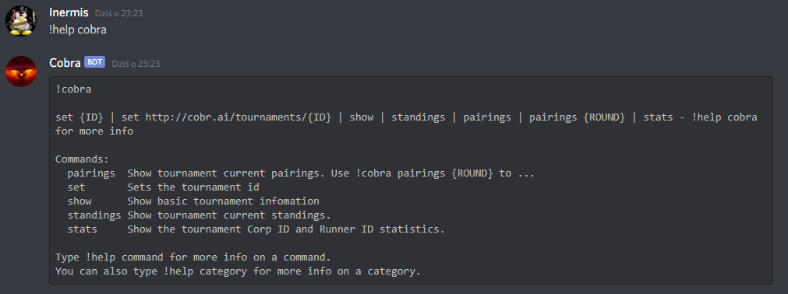
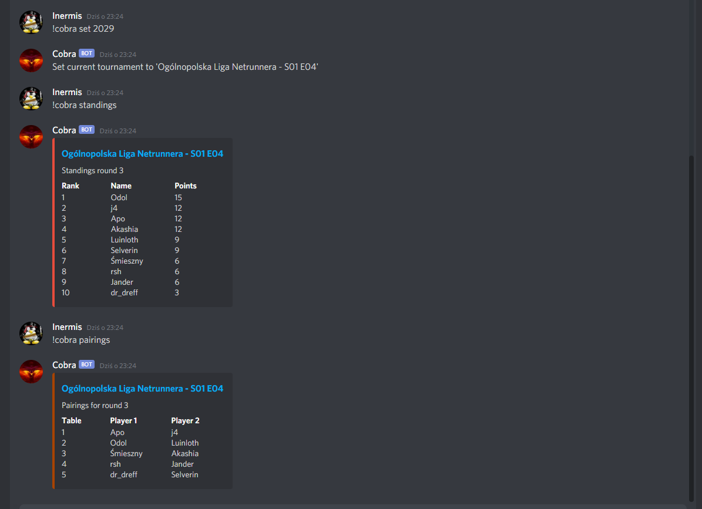
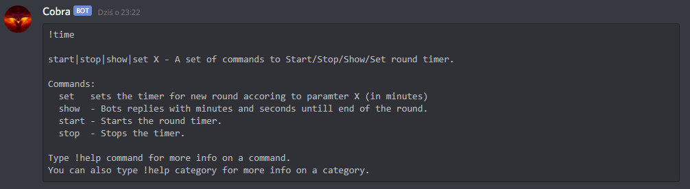

# About Cobra Bot

Hi! I am Cobra! 
I am [Discord](https://discord.com/) Bot that helps you run online Netrunner Tournaments using Discord.
I can integrate with Cobra.AI and I manage your round time directly from your distcord channel!

#### Coba.AI Integration commands: 


#### Cobra.AI Integration example: 


#### Time commands: 



## Invite Cobra Bot to your discord server
You can ask your discord server administartor to invite me by giving this link:

https://discord.com/api/oauth2/authorize?client_id=837045273128861727&permissions=19456&scope=bot

Please keep in mind that there is no guarantee I will work. Please report any issues on github.

# Create your own Cobra Bot 

1. Get Bot token 
2. Install bot locally or in cloud on Replit
3. Run 

## How to get Bot Token
Create your discord bot and get tocken on https://discord.com/developers/

## A) Install & Run on Replit.com

## Installation 

1. Go to https://replit.com create account
2. Import project from GitHub: adamstradomski/Cobra-Bot.git

## Usage

1. create / edit file .replit:
```bash
language = "python3"
run = "python main.py"
```
2. Setup environment variable discord_bot_token
3. Click Run

## Keep Alive Server
To keep aliave your server after you close your browser window. Goto https://uptimerobot.com/ create account, and run monitor each 5 minutes to ping your webserver. 

## B) Install & Run locally

### Installation 

```bash
git clone git@github.com:adamstradomski/Cobra-Bot.git
```
### Usage

```bash
discord_bot_token=<bot_token> python main.py
```

# Contributing
Pull requests are welcome. For major changes, please open an issue first to discuss what you would like to change.

# License
[MIT](https://choosealicense.com/licenses/mit/)